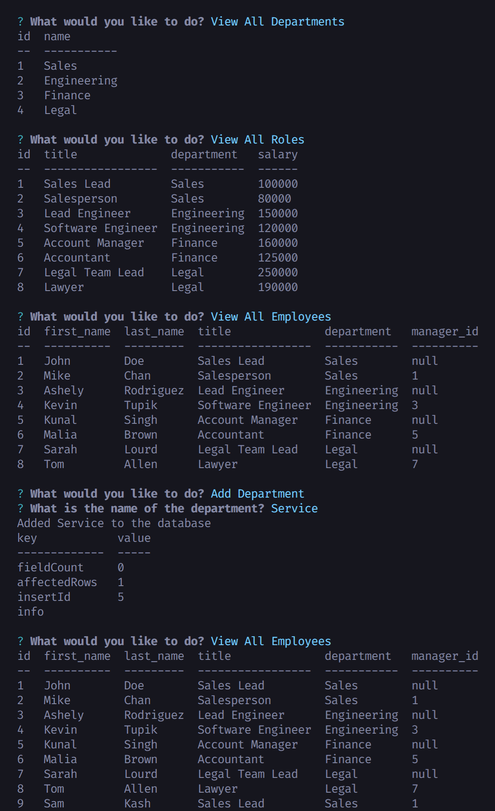

# staff-tracker

## Description

AS A business owner

I WANT to be able to view and manage the departments, roles, and employees in my company

SO THAT I can organize and plan my business

## Table of Contents

- [Usage](#usage)
- [Screenshots](#screenshots)
- [Questions](#questions)

## Usage

Use staff-tracker to view and manage the departments, roles, and employees in my company database.

Check out this <a href="https://drive.google.com/file/d/1rx7V9IxBDtnqbCsx-Ss5kXB76wOeW2lw/view?usp=sharing">demo</a> video showing the app in action.

## Screenshots

## Questions

**How to reach me**

- <a href="https://github.com/joesen-dev">Github</a>
- Email senjoseph90@gmail.com
